This is a [Next.js](https://nextjs.org/) project bootstrapped with [`create-next-app`](https://github.com/vercel/next.js/tree/canary/packages/create-next-app).

## Getting Started

First, run the development server:

```bash
pnpm run dev

```

Open [http://localhost:3000](http://localhost:3000) with your browser to see the result.

#### To start the server, go to pocketbase-backend folder and type the following command:

```bash
./pocketbase.exe serve
```

#### Output:

```bash
> Server started at: http://127.0.0.1:8090
  - REST API: http://127.0.0.1:8090/api/
  - Admin UI: http://127.0.0.1:8090/_/
```

Open [http://127.0.0.1:8090/_/](http://127.0.0.1:8090/_/) with your browser to see the Admin UI.

#### Login with the following Admin credentials:

```bash
Email: admin@admin.com
Password: adminpassword
```

#### Test user credentials for the frontend

```bash
Email: test@test.com
Password: userpassword
```

## Screenshots and steps

### Before login/register

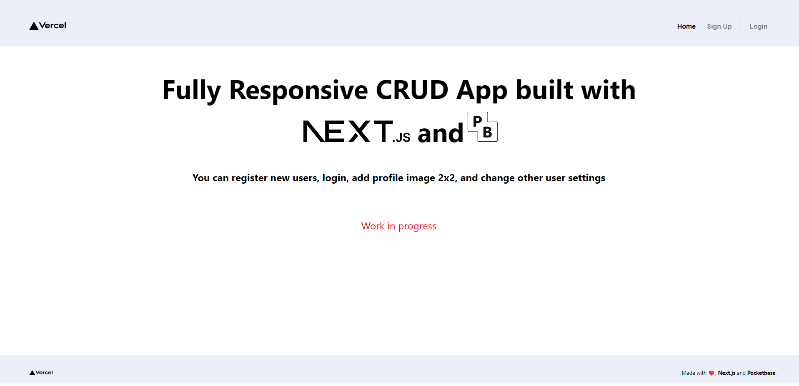

### Register

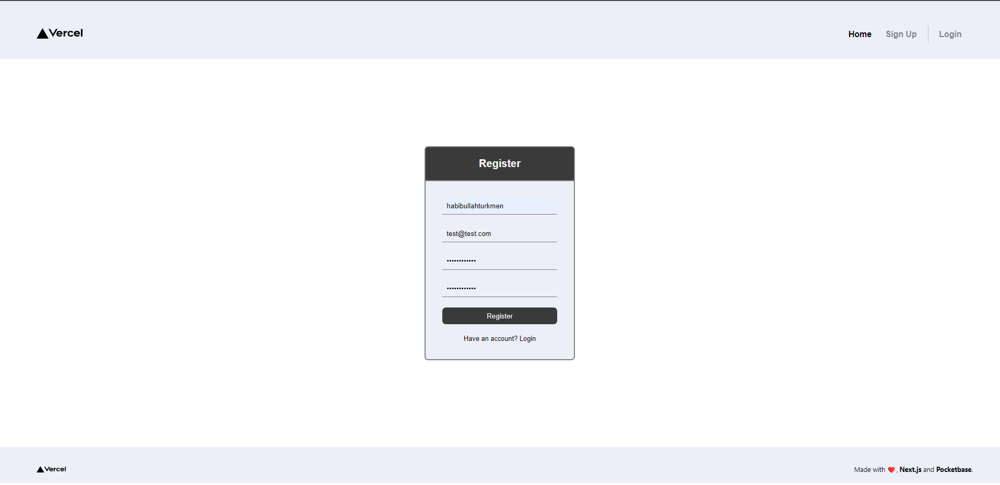

### Login

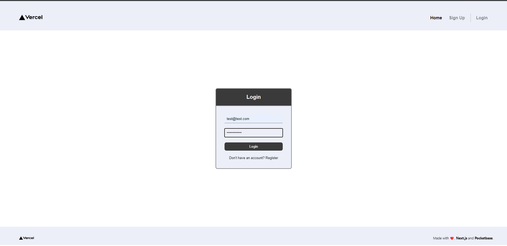

### After Login

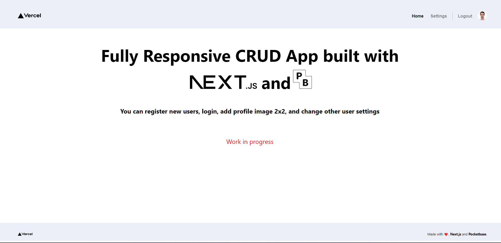

### Settings Page

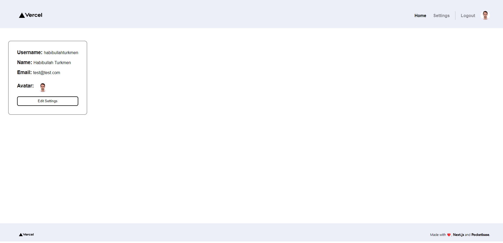

### Edit Settings

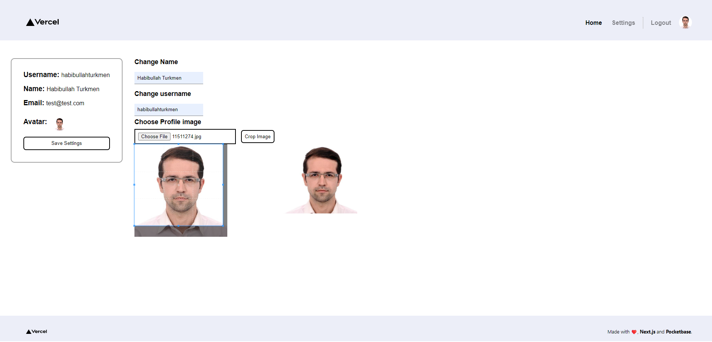

## Mobile Screenshots

<p align="center" style="display:flex; gap: 1em; flex-wrap: wrap">
  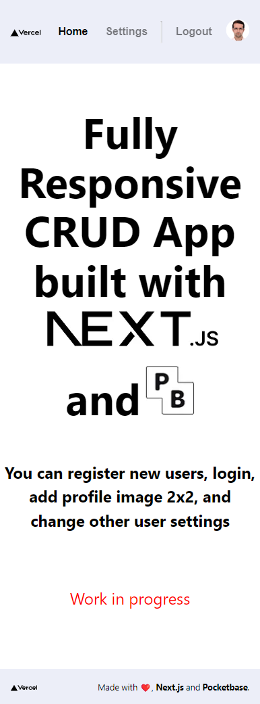
  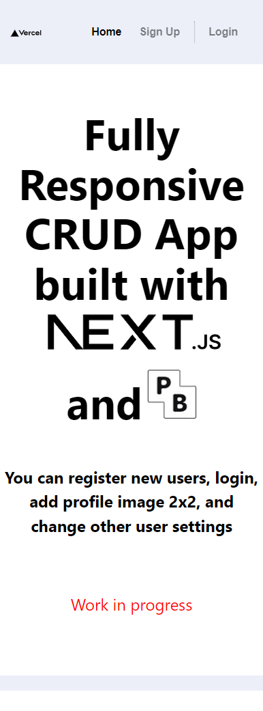
  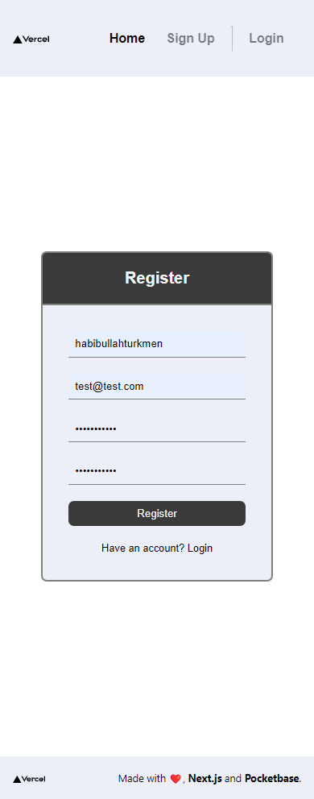
  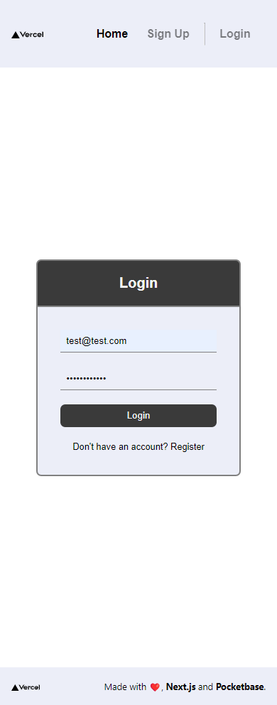
  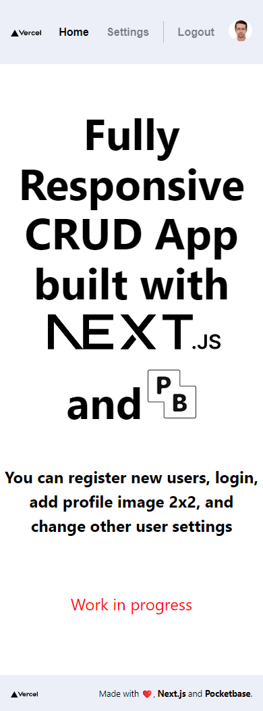
  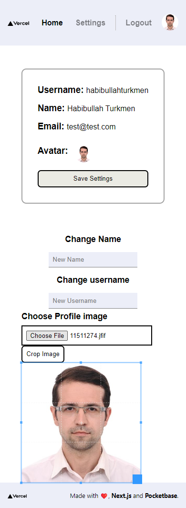
</p>
